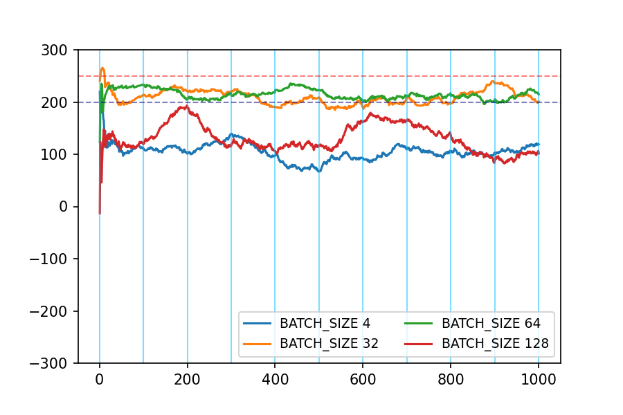
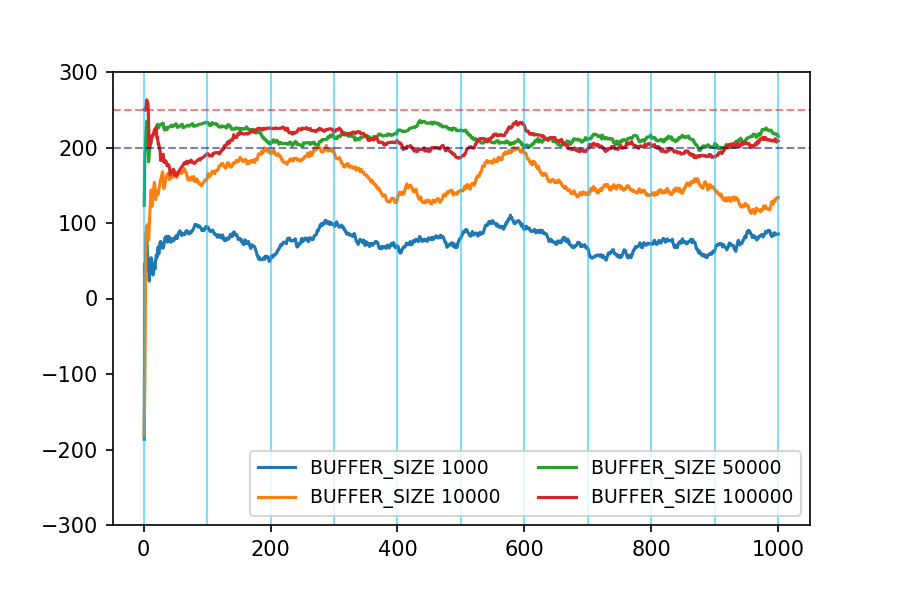
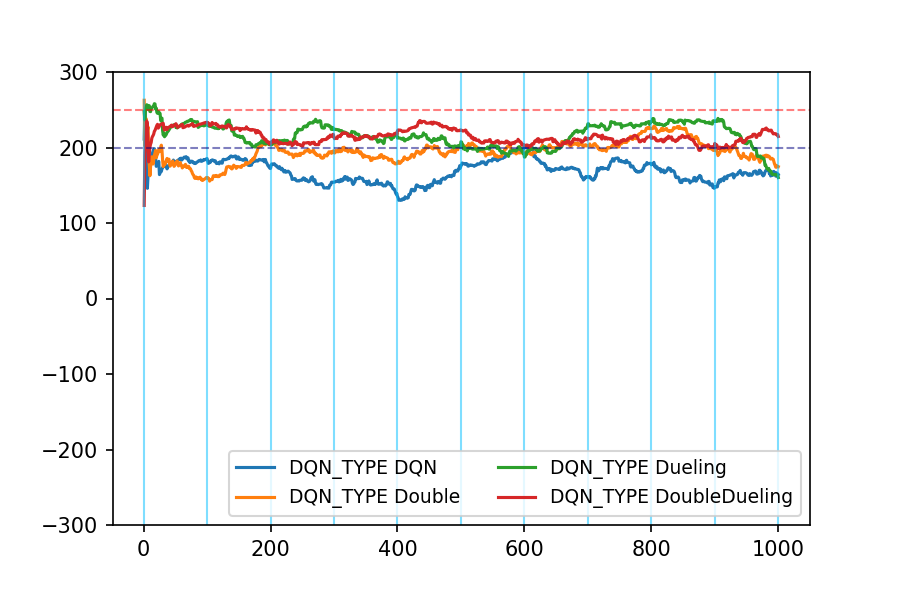
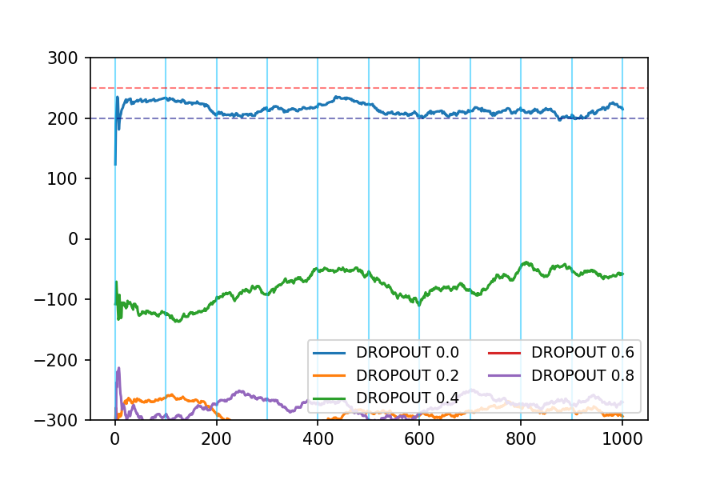
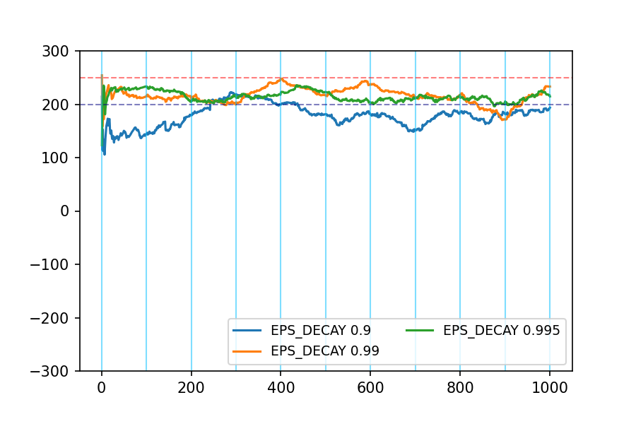
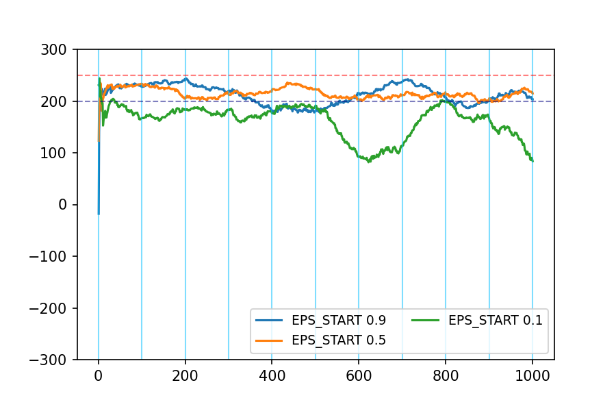
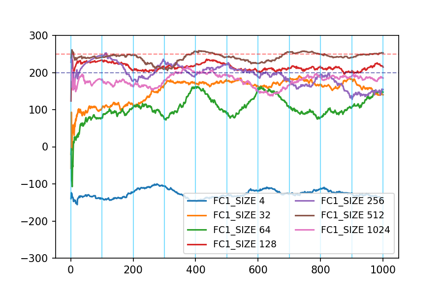
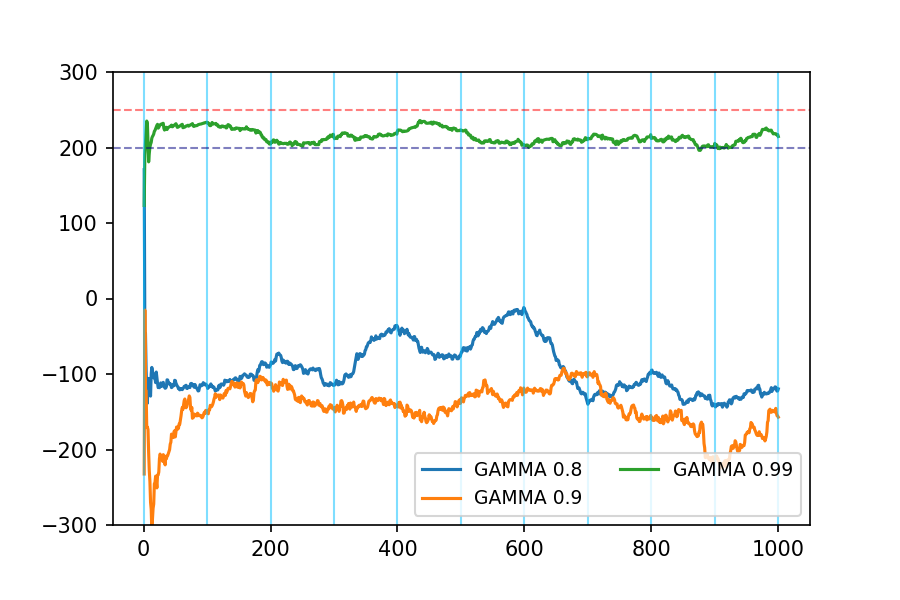
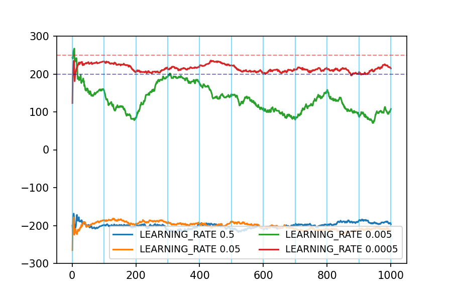
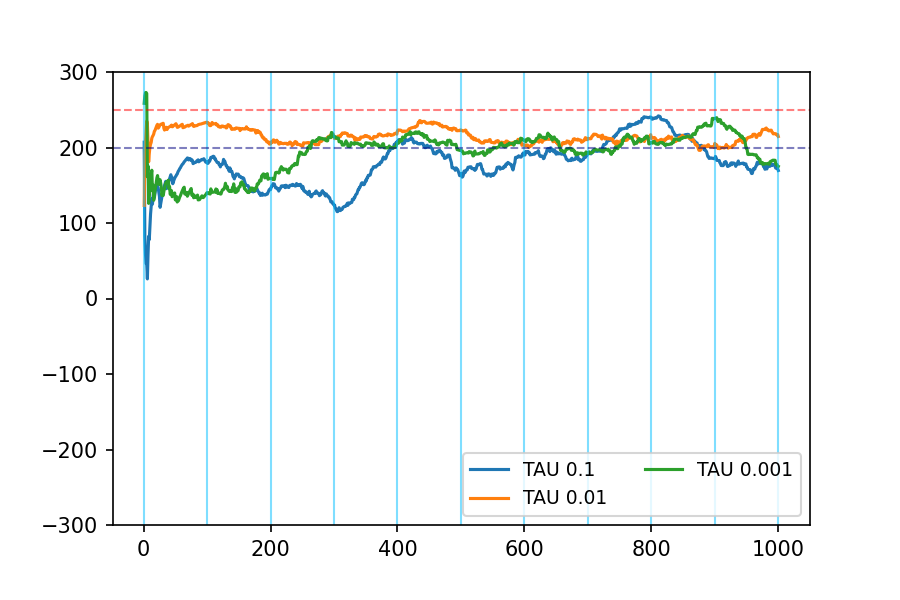

# LunarLander-v2로 알아보는  최적의 Hyper parameter
강화학습에 사용되는 알고리즘들은 다양하며, 알고리즘마다 최적의 Hyper parameter를 찾아서 시행착오를 최소화하여 좋은 모델을 학습하는 것이 무엇보다 중요함
하지만 여러 개의 Hyper parameter중 어떤 값이 최적인지 Trial&Error로 확인해볼 수 밖에 없어 시간이 많이 소요되므로, 본 프로젝트를 통해 유사한 환경에서 적정 값을 알아보고자 함

1. Continuous environment (8개)
2.  Discrete action space (4개)

조건 하에서 DQN 기반의 알고리즘들의 적정 Hyper parameter 범위를 찾는 것이 목표

Hyper parameter는 Stochastic environment인 WIND의  유무별로 각각 확인하며, 각각의 환경에서 학습된 모델이 WIND 유무에 따라 어떤 결과를 보여주는지도 확인

`※ WIND 없는 상태에서 학습한 모델은 WIND 상태에서 테스트하고 반대로도 테스트하여, 정상 범위 내 동작여부 검증`

# 환경 및 데이터셋 설명
OpenAI GYM – LunarLander-v2 환경 사용

코드 구동에 필요한 Python 라이브러리들은 다음과 같음
- `Gym[box2d]`
- `Matplotlib (그래프 Plot)`
- `Imageio (플레이 영상 저장)`
- `Torch (Deep Network구현)`

우주선의 초기값(Observation space)은 랜덤으로 주어짐
- 초기 속도, 각도, 각속도 등은 모두 랜덤
- 동일한 학습 환경을 위하여 학습용 SEED는 0을 사용, 검증용 SEED는 10을 사용

WIND 환경에서는 랜덤한 방향에서 랜덤한 세기로 바람이 발생하여 높은 점수 달성이 어려움

**※ 참고사항 : WIND의 경우 LunarLander 환경의 Bug로 SEED 적용이 불가능**

# 파일 및 폴더 구조
모든 소스코드, 모델, 로그, 그래프 등이 포함되어 있으며, 아래 설명 참고

### 폴더
- `model` : 학습한 모델이 저장되는 폴더
- `mp4` : 녹화된 플레이영상이 저장되는 폴더
- `score` : 모델의 성능측정 결과가 저장되는 폴더 (csv+png)

### 파일
- `hw.py` : 학습/테스트 파일
- `graph_train.ipynb` : 학습 성능결과 통합 그래프 생성 (score 폴더 내 csv 기반)
- `graph_test.ipynb` : 테스트 성능결과 통합 그래프 생성 (score 폴더 내 csv 기반)
- `*.log` : 학습/테스트 수행로그

# 수행방법
모델 학습 및 Test를 위해서는 `rl.py` 코드 상단 부분의 전역변수를 수정한 뒤 수행
수정해야 하는 항목은 작성된 주석을 참고
```python
# GYM 환경설정
TEST = True            # Test(테스트 모드) 여부, True:Global에서 지정한 Hyper parameter만 수행, False:테스트 대상 Hyper parameter 전체에 대해 수행

REPLAY = True          # Replay(모델 테스트) 여부, True:저장된 모델 테스트, False:모델 학습
RECORD = True          # 모델을 영상으로 저장 여부, True:영상 저장(첫 5개 Episode), False:영상 저장하지 않음
GYM = 'LunarLander-v2' # OpenAI GYM 명칭
WIND = True            # WIND(Stochastic environment) 사용여부
SEED = 10              # SEED
TARGET_RETURN = 200    # 목표값, 그래프용
STRETCH_GOAL = 250     # 도전목표값, 그래프용

# Hyper parameters
FC1_SIZE = 128         # Hidden layer 1 크기
FC2_SIZE = 128         # Hidden layer 2 크기
BUFFER_SIZE = 50000    # ReplayBuffer 크기
BATCH_SIZE = 64        # Minibatch 크기
DROPOUT = 0.0          # Dropout
GAMMA = 0.99           # 할인율 (discount factor)
TAU = 0.01             # 학습 모델 Soft update(q → q_target) 비율
LEARNING_RATE = 0.0005 # 학습율
EPS_START = 0.5        # Epsilon 시작 비율
EPS_END = 0.01         # Epsilon 최종 비율
EPS_DECAY = 0.995      # Epsilon 감소율

UPDATE_EVERY = 4       # 학습 주기
UPDATE_RATIO = 1.0     # Replay Buffer에서 업데이트를 시작할 비율 (BATCH_SIZE 기준)
TOTAL_EPISODES = 2000  # 최대 Episode 개수
MAX_TIMESTAMP = 1000   # Episode당 최대 Timestamp

# 알고리즘
USE_LINEAR_EPS_DECAY = False
USE_DOUBLE_DQN = True
USE_DUELING_DQN = True
```

모델의 시각화는 별도로 작성한 `graph_train.ipynb` 또는 `graph_test.ipynb` 파일을 수행

# 수행 결과
Wind환경이 아닌 경우 변별력이 없으므로, `Wind환경에서 수행한 결과`만 표시

시간상 모든 조합을 수행할 수는 없으므로, 아래 기본 Hyper parameter에서 각 항목별 값만 변경하면서 학습  
테스트는 정확하게 수행하기 위해 SEED를 10에서 100까지 10씩 증가시키며 10개에 대해 수행하며, SEED별로 100개의 Episode를 수행함

### 기본 Hyper parameter 설정값
| 항목             | 기본값           |
| -------------- | ------------- |
| WIND           | WIND          |
| FC1\_SIZE      | 128           |
| FC2\_SIZE      | 128           |
| BUFFER\_SIZE   | 50000         |
| BATCH\_SIZE    | 64            |
| DROPOUT        | 0             |
| GAMMA          | 0.99          |
| TAU            | 0.01          |
| LEARNING\_RATE | 0.0005        |
| EPS\_START     | 0.5           |
| EPS\_END       | 0.01          |
| EPS\_DECAY     | 0.995         |
| DQN\_TYPE      | DoubleDueling |

### 학습 소요시간 및 테스트 시 95% 신뢰구간
| 테스트 항목               | 소요시간  | 95% 신뢰구간 (Test)  | 테스트 항목                   | 소요시간  | 95% 신뢰구간 (Test)  |
| -------------------- | ----- | ---------------- | ------------------------ | ----- | ---------------- |
| FC1\_SIZE: 4         | 365s  | \-126.883 ±0.021 | GAMMA: 0.8               | 1662s | \-93.248 ±0.067  |
| FC1\_SIZE: 32        | 1938s | 152.291 ±0.061   | GAMMA: 0.9               | 4600s | \-145.793 ±0.061 |
| FC1\_SIZE: 64        | 1837s | 105.137 ±0.061   | GAMMA: 0.99              | 1540s | 214.697 ±0.019   |
| FC1\_SIZE: 128       | 1523s | 214.697 ±0.019   | TAU: 0.1                 | 1480s | 178.682 ±0.060   |
| FC1\_SIZE: 256       | 1662s | 194.506 ±0.055   | TAU: 0.01                | 1840s | 214.697 ±0.019   |
| FC1\_SIZE: 512       | 2995s | 241.284 ±0.023   | TAU: 0.001               | 2138s | 192.560 ±0.054   |
| FC1\_SIZE: 1024      | 5663s | 178.807 ±0.032   | LEARNING\_RATE: 0.5      | 315s  | \-200.501 ±0.014 |
| BUFFER\_SIZE: 1000   | 1704s | 76.427 ±0.030    | LEARNING\_RATE: 0.05     | 471s  | \-200.810 ±0.019 |
| BUFFER\_SIZE: 10000  | 1465s | 156.106 ±0.053   | LEARNING\_RATE: 0.005    | 1497s | 132.997 ±0.070   |
| BUFFER\_SIZE: 50000  | 1613s | 214.697 ±0.019   | LEARNING\_RATE: 0.0005   | 1443s | 214.697 ±0.019   |
| BUFFER\_SIZE: 100000 | 1592s | 205.760 ±0.028   | EPS\_START: 0.9          | 1535s | 212.349 ±0.039   |
| BATCH\_SIZE: 4       | 1720s | 105.047 ±0.032   | EPS\_START: 0.5          | 1781s | 214.697 ±0.019   |
| BATCH\_SIZE: 32      | 1806s | 209.730 ±0.027   | EPS\_START: 0.1          | 1559s | 161.575 ±0.062   |
| BATCH\_SIZE: 64      | 1689s | 214.697 ±0.019   | EPS\_DECAY: 0.9          | 1594s | 178.812 ±0.041   |
| BATCH\_SIZE: 128     | 1895s | 130.670 ±0.052   | EPS\_DECAY: 0.99         | 1606s | 216.136 ±0.029   |
| DROPOUT: 0.0         | 1919s | 214.697 ±0.019   | EPS\_DECAY: 0.995        | 1609s | 214.697 ±0.019   |
| DROPOUT: 0.2         | 2353s | \-289.582 ±0.033 | DQN\_TYPE: DQN           | 1394s | 168.832 ±0.029   |
| DROPOUT: 0.4         | 1619s | \-80.239 ±0.050  | DQN\_TYPE: Double        | 1245s | 194.474 ±0.029   |
| DROPOUT: 0.6         | 1970s | \-457.971 ±0.048 | DQN\_TYPE: Dueling       | 1680s | 216.658 ±0.032   |
| DROPOUT: 0.8         | 1215s | \-276.823 ±0.030 | DQN\_TYPE: DoubleDueling | 1495s | 214.697 ±0.019   |

### 테스트 결과 그래프
아래는 테스트 결과 그래프이며, 하늘색 수직선이 SEED 경계  
그래프에 표시된 Score는 최근 100개의 평균 점수임












# 플레이 영상
확인된 최적의 Hyper parameter로 학습된 모델의 Wind 환경에서의 5회 연속 플레이 결과입니다. 5회 평균 점수는 260점입니다.
<video src="./mp4/LunarLander-v2_TEST_WIND_512_50000_64_0.0_0.99_0.01_0.0005_0.5_0.995_DoubleDueling_260.mp4">